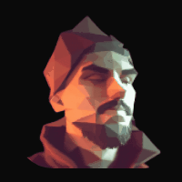

<p align="center">
  
  
</p>

<h1 align="center">dotrift</h1>
<p align="center">Dot-repulsion particle effect for images <em>and text</em>.</p>
<p align="center">
  <a href="https://t0m13.github.io/dotrift/"><strong>→ Live demo</strong></a>
</p>

Hover to scatter dots, click for a shockwave, hold to charge a bigger one, double/triple-tap to stack. Works on any image or any HTML text element — picks up its font, size, color, weight, and `text-transform` automatically. Zero dependencies, single ES module, no build step.

---

## The simplest way — just add `data-dotrift` to any image

```html
<script type="module" src="dotrift/src/auto-init.js"></script>


```

That's it. The script reads the image's natural size, wraps it in a canvas, and applies the effect automatically. The original image is the placeholder until the canvas is ready — no flash, no layout shift.

Override any option via data attributes:

```html

```

---

## Text mode — add `data-dotrift-text` to any element

```html
<h1 data-dotrift-text>Hello world</h1>
```

The script reads the element's *computed* font, size, weight, color, line-height, letter-spacing and `text-transform` — so it looks identical to your CSS, just rendered as dots. Web fonts are awaited via `document.fonts.ready` before rasterizing.

```html
<h1
  data-dotrift-text
  data-grid="120"
  data-dot-size="0.85"
  data-repel-radius="20"
>HELLO</h1>
```

---

## Script tag (no bundler)

```html
<script src="dotrift/dotrift.umd.js"></script>


<script>
  const img = document.getElementById('photo');
  const canvas = document.createElement('canvas');
  img.parentNode.insertBefore(canvas, img);
  img.style.display = 'none';

  Dotrift.create(canvas, img.src, { size: 200, grid: 100 });
</script>
```

---

## ES module

```js
import { createDotrift } from 'dotrift';

const canvas = document.querySelector('#my-canvas');
const fx = createDotrift(canvas, '/photo.jpg', { size: 200, grid: 100 });

// Update live
fx.set({ repelRadius: 50 });

// Clean up
fx.destroy();
```

---

## React

```jsx
import { DotriftCanvas } from 'dotrift/react';

export default function Profile() {
  return (
    <DotriftCanvas
      src="/photo.jpg"
      size={200}
      grid={110}
      repelRadius={30}
      style={{ borderRadius: 16 }}
    />
  );
}
```

Or use the hook directly:

```jsx
import { useDotrift } from 'dotrift/react';

export default function Profile() {
  const ref = useDotrift('/photo.jpg', { size: 200, grid: 110 });
  return <canvas ref={ref} style={{ borderRadius: 16 }} />;
}
```

Works with **TanStack**, **Next.js**, **Remix**, **Vite**, or any React setup.

---

## Vue / Svelte / any framework

The core is framework-agnostic. Get a reference to a canvas element and call `createDotrift`:

```js
// Vue
import { onMounted, onUnmounted, ref } from 'vue';
import { createDotrift } from 'dotrift';

const canvasRef = ref(null);
let fx;

onMounted(() => {
  fx = createDotrift(canvasRef.value, '/photo.jpg', { size: 200 });
});
onUnmounted(() => fx?.destroy());
```

---

## Config options

### Core
| Option | Default | Description |
|---|---|---|
| `size` | `200` | Canvas size in px (width & height). Overridden by `width`/`height`. |
| `width` / `height` | `null` | Canvas dimensions. For text mode, derived from the rendered text. |
| `grid` | `150` | Dots along the width axis. More = sharper, heavier. |
| `dotSize` | `1.2` | Dot radius as fraction of step. `1.0` = touching, `<1` = gaps, `>1` = overlap. |
| `repelRadius` | `25` | Mouse force radius in px. |
| `repelForce` | `22` | Mouse force strength. |
| `friction` | `0.5` | Velocity damping (0–1). |
| `spring` | `0.004` | Spring force pulling dots home. |
| `background` | `null` | Fill color. `null` / `'transparent'` = transparent. |
| `onReady` | `null` | Callback fired after first frame. |

### Interaction
| Option | Default | Description |
|---|---|---|
| `attract` | `false` | Cursor pulls dots in instead of pushing them away. |
| `ringStrength` | `3` | Click shockwave strength. `0` = disabled. |
| `ringSpeed` | `180` | Shockwave expansion speed in px/s. |
| `ringWidth` | `14` | Shockwave ring thickness in px. |
| `ringDuration` | `900` | Shockwave lifetime in ms. |
| `multiTapWindow` | `400` | Ms within which rapid taps stack the next shockwave. |
| `multiTapMax` | `5` | Max stacked tap multiplier. |
| `holdThreshold` | `200` | Press ≥ this duration counts as a hold, not a tap. |
| `chargeDuration` | `1000` | Ms to reach charge level 1. (Charge is unbounded — keep holding for absurd values.) |
| `chargeBoost` | `3` | Per-frame active force is ×`(1 + charge × chargeBoost)` while held. |
| `chargeShockBoost` | `5` | Release shockwave strength is ×`(1 + charge × chargeShockBoost)`. |
| `globalRipples` | `false` | When `true`, shockwaves propagate across every dotrift instance on the page. |

### Idle animation
| Option | Default | Description |
|---|---|---|
| `idleAnimation` | `false` | `'drift'`, `'breathe'`, or `'wave'`. |
| `idleStrength` | `1` | Amplitude multiplier. |
| `idleSpeed` | `1` | Frequency multiplier. |
| `idleDelay` | `2000` | Ms of no interaction before idle fades in. |

### Text mode
Passed as the `imageSource` argument (or via `data-*` attributes when using `data-dotrift-text`).

| Option | Default | Description |
|---|---|---|
| `text` | `''` | The string to render. `\n` makes multiline. |
| `font` | computed | Full CSS font shorthand. Auto-pulled from the element's computed style. |
| `color` | computed | Fill color. |
| `padding` | `0` | Pixels around the glyphs. |
| `align` | `'center'` | `'left'`, `'center'`, `'right'`. |
| `letterSpacing` | `0` | Px. |
| `lineHeight` | `1.2` | Multiplier. |

---

## License

MIT © [Tamas Illes](https://tamas-illes.com)
